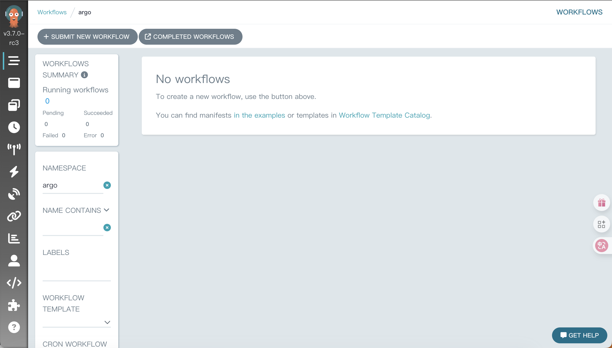

# argocd workflow notes
> https://argo-workflows.readthedocs.io/en/stable/
Argo Workflows is an open source container-native workflow engine for orchestrating parallel jobs on Kubernetes.

## deploy
> no need to login
```bash
kubectl create namespace argo
kubectl apply -n argo -f https://github.com/argoproj/argo-workflows/releases/download/v3.7.0-rc3/quick-start-minimal.yaml
```
## delete
```bash
kubectl delete -n argo -f https://github.com/argoproj/argo-workflows/releases/download/v3.7.0-rc3/quick-start-minimal.yaml
kubectl delete namespace argo
```
## open web ui
```bash
kubectl port-forward -n argo svc/argo-server 2746:2746
```
https://localhost:2746

